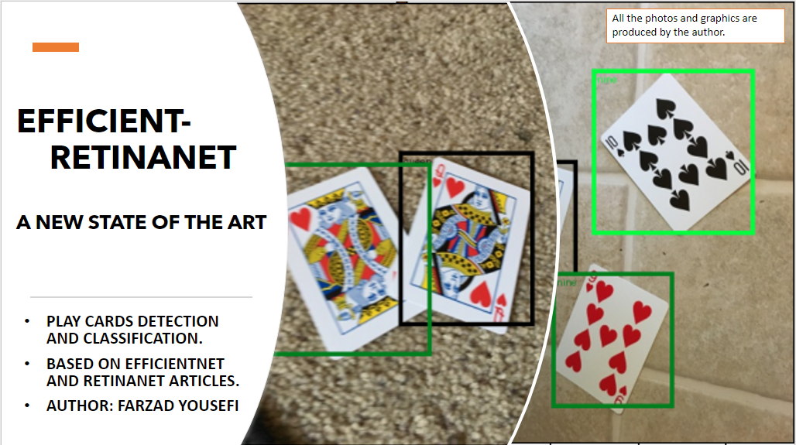
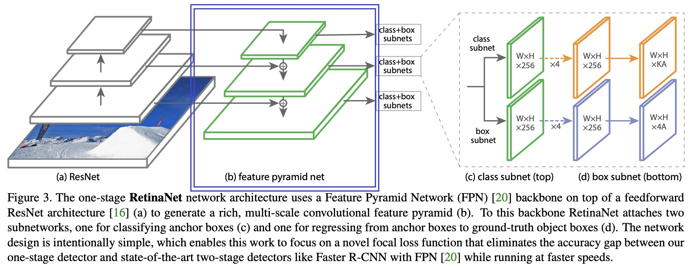

<a href="https://www.nobelprize.org/prizes/peace/2023/mohammadi/facts/"> </a>



# Efficient Retinanet#6
## Abstract
On the surface, they might seem to be a few absurd little squares. however, many mind-blowing algorithms and breakthrough methods were involved to produce these colorful figures. It has never been rare among AI researchers that combine and evaluate different models to discover their methods. When I read about Retinanet and Efficientnet, I had a mind to combine them, but I put it off till now. One reason for this may be that I found Efficientnet article very heavy going when I studied it for the first time. I thought that Retinanet based on Resnet50 had expired by 2023. Every day, more companies, factories, and organizations decide to invest their capital in the area of AI. New conundrums around us need more sophisticated methods and algorithms. 
I had some ideas at first, but I should confess that, in the middle of the way, I realized this project was going to get so complicated for such simple remedies as I had at the beginning. I presume the most essential question would be how we would implement RPN (features pyramid network) along with Efficientnet as its backbone. If it is your question, too, stay with me and let me "show you how deep the rabbit hole goes." I consider this part as informative as it is challenging. Please be patient, the whole process will be thoroughly expounded through this tutorial.

<br><br>

## Table of Contents
- <a href='#architecture'>Architecture</a>
- <a href='#requirements'>Requirements</a>
- <a href='#description'>Description</a>
- <a href='#performance'>Performance</a>
- <a href='#references'>Reference</a>

<br>

## Architecture
The original Retinanet is composed of an FPN with 3 main layers as you can see in the following figure. This is because Resnet50 architecture has 4 layers for feature extraction and the paper uses three last layers of it. However, there are two extra layers called P6 and P7 at the bottom of this FPN which are not shown here. In total, five layers correspond to each scale in the following list [32, 64, 128, 256, 512]. 

In the current repository, this architecture has changed a bit to be able to combine with Efficientnet. In Efficientnet, seven layers are available for feature extraction. I used the six last layers of it for feature extraction in the architecture of Efficient Retinanet. In total, eight layers correspond to each scale in the following list [64, 128, 128, 256, 256, 256, 512, 512]. Seemingly, it might look a bit strange, but in practice, it works fine. The reason why I chose these scales is related to the output ratios of each layer of Efficientnet. 

<center>  </center>
<br><br>


## Requirements
This project is developed on Pytorch framework, so make sure you have installed the latest version of torch on your pc. It can run either on cuda or cpu.
<br><br>


## Description 
This repository contains the following files and directories:


`./data`
- `data.charlotte_dataset`: A merely example of how to make a dataset class for your custom dataset.
- `data.dataset`: This class inherents from torch.utils.data and your custom dataset should be used in this class at last. This class let you use num_workers > 0 and multiprocessing in torch.dataloader later which many projects don't support.
- `data.play_card_dataset`: This is compatible with the dataset that I have provided its download link in the reference section. Every statistics in this project is based on performance of the model on this dataset.
- `data.voc2007_dataset`: This module lets you use voc datasets [2007 - 2012]. 
  
```
- dataset/
    - charlotte_dataset.py
    - dataset.py
    - play_card_dataset.py
    - voc2007_dataset.py

```


`./model`
- `model.efficient_retinanet`: The whole model is implemented here. You can easily make an instance of it and train it by yourself.
- `model.lightning_trainer`: This module provides a trainer using pytorch lightning that helps you use its wonderful features for Efficient-Retinanet. 
  
```
- model/
    - efficient_retinanet.py
    - lightning_trainer.py

```
`./utils`
- `utils.config`: It is presumeablly one of the most important files in this repository. It gets user preferences and feed them to the model. You can change every property in this file as you wish: num_workers, batch_size, epochs etc  
- `utils.gpu_check`: This module is just to check your gpu's temperature, and trys to keep the temperature of your gpu in the safe zone.
- `utils.visualisation`: This module helps you to visualize the model's outputs.
  
```
- utils/
    - config.py
    - gpu_check.py
    - visualisation.py

```
`example.py`: This python script is a simple example of how you can use this model. In this file you will be shown how to train your model with some dummy images and bounding boxes.

`main.py`: This file handles users' inputs from consule. Corresponding to users' preferences, it decide to lunch `trainer.py` or `monitior.py`. 


### How to run the project:
As mentioned before, you can edit the config.py file located in the utils directory, or you can sent your prefrences through consule[terminal / CMD]. 
```
python main.py --help
Usage: main.py [options]

Options:
  -h, --help            show this help message and exit
  -p DIR_TO_DATASET, --path=DIR_TO_DATASET
                        Path to the desired dataset.

  -d AVAILABE_DEVICE, --device=AVAILABE_DEVICE
                        Choose the device you want to start training
                        on.['cuda','cpu']

  -g GPU_UNDER_CONTROL, --gpu=GPU_UNDER_CONTROL
                        True if you don't want to put a lot of pressure on
                        your gpu card. It will keep your GPU's temperature in
                        the safe zone.

  -m BACKBONE_MODEL_NAME, --model=BACKBONE_MODEL_NAME
                        The possible backbone models are as follows:
                        efficientnet-b[0-7] -> efficientnet-b4

  -l DIR_TO_PRETRAINED_MODEL, --load=DIR_TO_PRETRAINED_MODEL
                        The directory to a pretrained model checkpoint.

  -w NUM_WORKERS, --workers=NUM_WORKERS
                        The directory to a pretrained model checkpoint.

  -t TRAIN, --train=TRAIN
                        If you want to start training your model based on your
                        dataset, set this arg True. Otherwise, it just monitor
                        the performance of your pretrained model.
```


## Performance
The most important part of this article undoubtedly is this section. Fortunately, I have kept a record of every single change on the mAP table as each epoch ended. I dare say that Efficient-Retinanet works significantly better and more accurate compared to the original Retinanet. To keep my expensive GPU card secure, I decided to alternate every batch with a delay of one second during the training process to make sure that my GPU's temperature is in the safe zone.

my system configuration is as bellow:

|#|device|model|
|-----|-----|----|
|1|Motherboard|MSI H610|
|2|CPU|Intel core-i5 12400|
|3|GPU|Nvidia RTX 2060 SUPER|
|4|Memory|1x A-data 8 GB|
|5|HDD|2x Green 500 GB|
|6|Power|Green Eco 600A|


The results that I acheived based on `Play card dataset` are as follows:

|#|Backbone|Epoch speed|Inference Speed|Number of parameters|Total size of parameters|mAP|mAP(50)|mAP(75)|
|----|------|-------|---------|-------|---------|----|-------|----| 
|1|Resnet50 (Original)|1.8 it/s|3.4it/s|32.3M|129 MB|20.1|29.1|22.5| 
|2|Efficientnet-b0|<ins>2.22it/s</ins>|<ins>4 it/s</ins>|14M|56 MB|41.2|62.6|48.3| 
|1|Efficientnet-b4|1.8it/s|2.8 it/s|27M|111 MB|<ins>62.5</ins>|<ins>85.8</ins>|<ins>72.8</ins>| 


## References:

The following list contains links to every resource that helped me implement this project.

1.  Kaggle dataset published by [UCI MACHINE LEARNING](https://www.kaggle.com/datasets/uciml/breast-cancer-wisconsin-data/data)
2.  The project which is developed by [BUDDHINI W](https://www.kaggle.com/code/buddhiniw/breast-cancer-prediction)
3.  Maths-ML developed by [Farzad Yousefi ](https://github.com/F-Yousefi/Maths-ML)
4.  House Price Prediction developed by [Farzad Yousefi ](https://github.com/F-Yousefi/House_Price_Prediction)
5.  Machine Learning course published by [Coursera ](https://www.coursera.org/specializations/machine-learning-introduction)
6.  Play Cards Dataset [link google drive]()
7.  pretrained models [resnet50, efficientnet-b0, efficientnet-b4] [link google drive]()


<a href="https://www.nobelprize.org/prizes/peace/2023/mohammadi/facts/"> </a>
